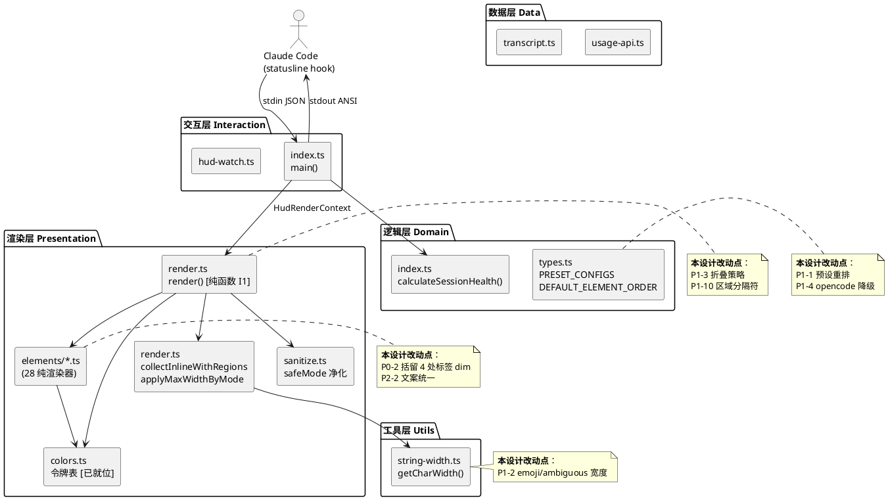
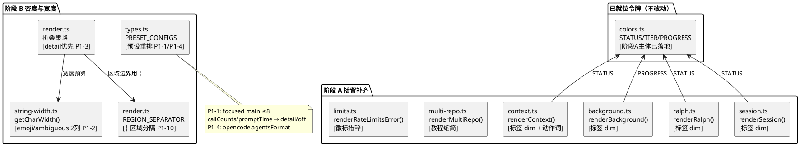
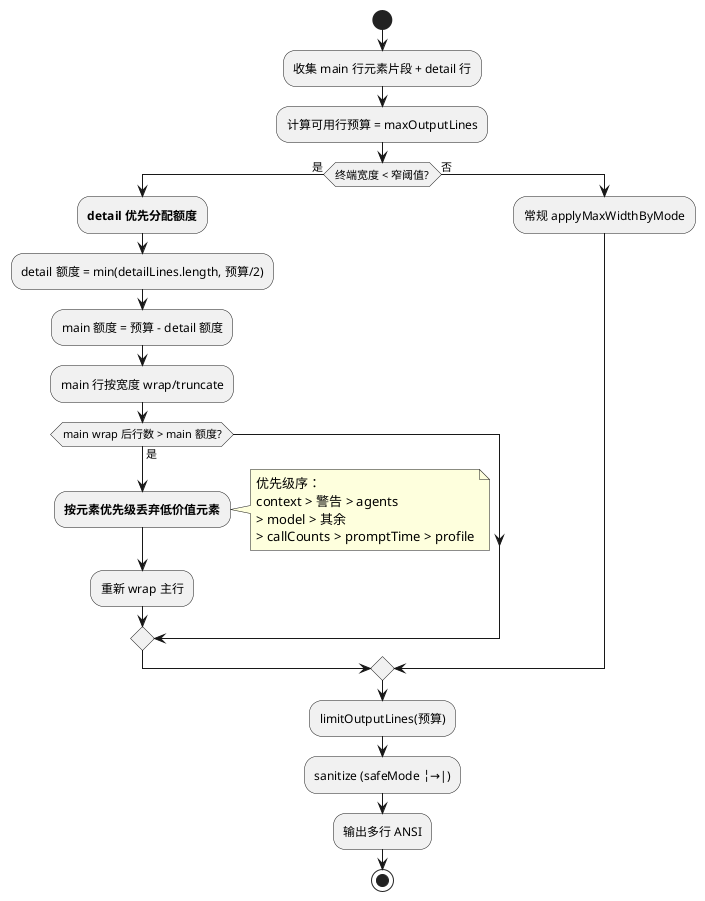
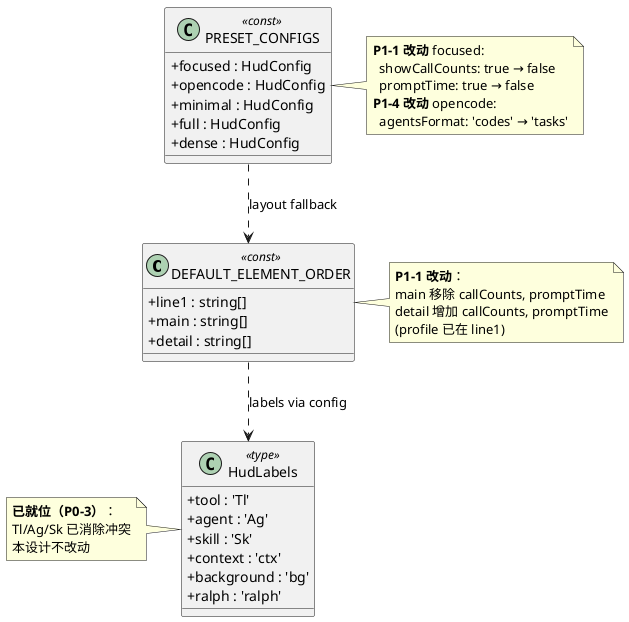

# OMC HUD 优化实现方案（技术设计文档）

> 文档版本：v1.0（2026-08-15）
> 文档性质：增量技术设计（工程落地级）
> 上游依据：
> - 架构设计：`docs/design/hud-architecture.md`（四层架构 + 公理 R1-R6 / C1-C6 / 八红线 + 不变量 I1/I3）
> - UI 审查与优化方案：`docs/design/hud-ui-review.md`（17/25 评分 + P1×9 / P2×14 问题清单 + 设计令牌 + 三阶段落地路径）
> - 优化原型：`docs/design/hud-prototype.html`（5 预设 × 2 主题 × 2 宽度 × 2 safeMode 视觉基准）
> 主方案：**方案 A · Linear Pulse** + 并入 gh 单字符语法 + TUI Native 字符令牌 →「一套语义，五档密度」
> 适用范围：`src/hud/`（渲染层 + 逻辑层 `index.ts` + 数据层 `usage-api.ts` 等）+ `src/utils/string-width.ts`
> 约束：不引入新依赖；保持 I1（渲染纯函数）/ I3（降级永不失败）；所有改动可追溯至 R1-R6 / C1-C6 / 八红线

---

## 〇、实现状态校准（关键前置）

> **重要发现**：在本次设计启动前，代码库已完成一次「Aurora 光谱语义 v2」改造（`src/hud/colors.ts` 注释标注"2026-08-15，UiDesigner 像素君"），**阶段 A（P0 一致性修复）的主体已落地**。本设计如实反映该状态，增量工作聚焦于「阶段 A 残留补齐 + 阶段 B + 阶段 C」。
>
> 此校准遵循「精准改动」原则——不重复设计已完成的工作，不编造不存在的缺口。

### 已落地项速览

| 优化项 | 状态 | 落地证据（文件:行号） |
|--------|:----:|----------------------|
| P0-1 颜色语义统一 | ✅ | `colors.ts:46-102`（STATUS/ACTIVITY/TIER/PROGRESS/FONT 令牌）、`colors.ts:170-195`（PERCENT_WARN=70/CRITICAL=90、getStateColor 五档）、`colors.ts:234-241`（getModelTierColor 蓝色系）、`colors.ts:214-220`（getTodoColor 进度色）、`index.ts:204-218`（calculateSessionHealth 复用 thresholds） |
| P0-3 符号冲突消除 | ✅ | `types.ts:501-503`（DEFAULT_HUD_LABELS: Tl/Ag/Sk）、`token-usage.ts:45/49`（r:/tot:）、`agents.ts:166-177`（formatDuration 超时改 ⏱） |
| P0-4 死配置清理 | ✅ | `session.ts:15-39`（renderSession 真渲染 ●/◐/○ 健康指示器）、`render.ts:493-496`（showHealthIndicator 传入） |
| P0-2 标签语法统一 | 🟡 | 已 dim：model/prd/prompt-time/profile/omcLabel/limits(5h:/wk:)/git/last-tool/api-key-source/session-summary/multi-repo(标记态)；**残留 4 处未 dim**：context/background/ralph/session |

### 待实现项速览（本设计增量范围）

| 优化项 | 状态 | 根因（文件:行号） |
|--------|:----:|------------------|
| P0-2 残留：4 处标签未 dim | ❌ | `context.ts:136/157`、`background.ts:38/78`、`ralph.ts:39`、`session.ts:39` |
| P0-1 残留：duration 阈值硬编码 | 🟡 | `index.ts:216-217`（120/60 魔法数，P2-13 残留，次要） |
| P2-2 文案统一（COMPRESS? / multi-repo / 错误徽标） | ❌ | `context.ts:51`（' COMPRESS?'）、`multi-repo.ts:218-224`（完整 echo 教程）、`limits.ts:306-309`（[API 429]/[API auth]/[API err]） |
| P1-1 主行密度预算 | ❌ | `types.ts:671-676`（main 组含 callCounts/promptTime）、`types.ts:887/893`（focused: showCallCounts:true/promptTime:true） |
| P1-2 宽度计量升级 | ❌ | `string-width.ts:95-102`（getCharWidth 无 emoji/ambiguous 判定，均 return 1） |
| P1-3 窄终端保底 | ❌ | `render.ts:781-789`（applyMaxWidthByMode 无 detail 优先保留 / 元素优先级丢弃） |
| P1-4 agent 编码降级 | ❌ | `types.ts:963`（opencode.agentsFormat='codes'） |
| P1-10 区域分隔符层级 | ❌ | `render.ts:722/726`（区域间用 DIM_SEPARATOR，无 REGION_SEPARATOR ╎） |
| 阶段 C 文档 | ❌ | README/CHANGELOG 未含符号词典与破坏性变更标注 |

---

# 一、需求与存量功能关系分析

## 1.1 需求功能与存量功能对比

### 1.1.1 已实现功能

> 已实现功能指需求与存量代码完全匹配或高度相似的部分。阶段 A 主体已由「Aurora v2」改造落地，下表逐项给出代码位置与匹配度判定依据。

| 需求功能（优化项） | 存量功能 | 代码位置 | 匹配度 | 判定依据 |
|-------------------|---------|---------|:------:|---------|
| **P0-1a** 档位色与状态色色相不相交（R-COLOR-1） | `TIER={opus:BRIGHT_BLUE,sonnet:BLUE,haiku:CYAN,unknown:WHITE}` 冷系；`STATUS={ok:GREEN,warn:YELLOW,critical:RED}` 暖系 | `colors.ts:46-78` | 100% | 冷暖色相环不相交，注释明确引用 R-COLOR-1；getModelTierColor 已用 TIER |
| **P0-1b** 百分比阈值全局唯一（R-THRESH-1） | `PERCENT_WARN=70`/`PERCENT_CRITICAL=90` 常量；`getStateColor` 五档；`getContextColor` 委托 getStateColor | `colors.ts:170-195` | 100% | context critical 85→90 已对齐 limits；单一常量表 |
| **P0-1c** 进度色 ≠ 危险色（R-THRESH-2） | `PROGRESS={good:GREEN,partial:CYAN,empty:DIM}`；`getTodoColor` 去 YELLOW；background 用 PROGRESS | `colors.ts:86-90/214-220`、`background.ts:28-36` | 100% | todos/background 不用状态黄，语义分离 |
| **P0-1d** session 健康阈值复用 config | `calculateSessionHealth(durationMs, contextPercent, thresholds)` 用 `thresholds.contextCritical/Warning` | `index.ts:208-218` | 75% | context 阈值已复用；**duration 120/60 仍硬编码**（L216-217，P2-13 残留） |
| **P0-2a** 标签 dim + 值着色（R-LABEL-1，已覆盖元素） | model/prd/prompt-time/profile/omcLabel/limits/git/last-tool/api-key-source/session-summary/multi-repo(标记态) 标签均 dim | 见 §〇 已落地表 | 75% | 10+ 元素已统一；**4 处残留未 dim**（context/background/ralph/session） |
| **P0-2b** 品牌降权（R-WEIGHT-3） | `[OMC#ver]` 默认前景非 bold；profile 非 bold；bold 仅 update 提醒 | `render.ts:400-401/411-419` | 100% | 注释明确 R-WEIGHT-3，bold 白名单执行 |
| **P0-3a** call-counts 符号消歧 | `DEFAULT_HUD_LABELS={tool:'Tl',agent:'Ag',skill:'Sk'}` | `types.ts:501-503` | 100% | 注释明确 P0-3，消除与 agent 编码 T/A/S 冲突 |
| **P0-3b** token r/s 自解释前缀 | `r:${...}` / `tot:${...}` | `token-usage.ts:45/49` | 100% | 替代裸 r/s，带冒号自解释 |
| **P0-3c** agent 超时符号隔离（R-SYM-5） | `formatDuration` 返回 '⏱'（≥10m）；'!' 仅留给异常 | `agents.ts:166-177` | 100% | 注释明确 P0-3/P2-04 |
| **P0-4** showHealthIndicator 死配置补齐 | `renderSession` 真渲染 `●/◐/○`（几何字符，宽度 1）；render.ts 传入 showIndicator | `session.ts:15-39`、`render.ts:493-496` | 100% | 注释明确 P0-4；配置与实现对齐 |

### 1.1.2 需要扩展的功能

> 需要扩展的功能指需求与存量代码部分匹配，需在现有基础上改造的部分。本节是本设计增量工作的主体。

| 需求功能 | 存量功能 | 差异说明 | 扩展方向 | 对应问题 |
|---------|---------|---------|---------|---------|
| **P0-2 残留** context/background/ralph/session 标签 dim | 4 元素标签为裸前景 `${labels.x}:` | 标签未 dim，违反 R-LABEL-1「标签永远 dim」 | 4 处改为 `dim(${labels.x}:)` + 着色值 | P1-09 |
| **P2-2a** ctx 动作词统一 | `context.ts:51` 输出 `' COMPRESS?'` | 疑问句式 + 非用户习惯命令名；与详情行 `run /compact` 不一致 | 改为 `'! compact'`（统一动作词，读自 thresholds） | P1-04 |
| **P2-2b** multi-repo 教程移出状态栏 | `multi-repo.ts:218-224` 输出完整 `echo {} > "..."` 命令 | 状态栏内嵌 shell 教程；Windows/cmd 下不成立；超长占位 | 缩为 `⚠ multi-repo (unmarked)`，引导移至文档 | P1-06 |
| **P2-2c** 错误徽标措辞明确 | `limits.ts:306-309` 输出 `[API 429]/[API auth]/[API err]` | `[API err]` 易误解为程序报错而非用量 API 失败 | 改为 `[usage:429]/[usage:auth]/[usage:err]` | P2-12 |
| **P1-1** 主行密度预算（focused ≤8） | `DEFAULT_ELEMENT_ORDER.main` 含 21 元素；focused 启用 callCounts/promptTime | 主行 15+ 元素超载，单调计数/纯计时抢注意力 | callCounts/promptTime 移 detail 或默认关；预设重排 | P1-01/P1-12/P2-06 |
| **P1-2** emoji/ambiguous 宽度按 2 列 | `getCharWidth` 仅判 isZeroWidth/isCJK，emoji/ambiguous return 1 | 含 emoji/箭头主行截断 off-by-width，破坏"恰好 maxWidth" | getCharWidth 增加 emoji/ambiguous 区段判定 → 2 | P1-13 |
| **P1-3** 窄终端 detail 优先保留 | `render.ts:781-789` 先 wrap 主行再 limitOutputLines，detail 被挤掉 | 窄屏最需上下文时 agents/todos/警告被折叠 | 折叠策略：detail 优先分配额度，主行按优先级丢弃低价值元素 | P1-14/P2-09 |
| **P1-4** opencode 预设 agent 编码降级 | `types.ts:963` opencode.agentsFormat='codes' | 30+ 编码记忆负担；默认预设不应使用 codes | opencode.agentsFormat 'codes'→'tasks'；codes 保留为高级可选 | P1-02 |
| **P1-10** 区域分隔符层级（L1 \| vs L2 ╎） | `render.ts:722/726` 区域间用 DIM_SEPARATOR，与元素分隔同构 | I/O/S 区域边界与元素边界不可区分 | 新增 REGION_SEPARATOR='╎'，区域间用 L2，区域内用 L1 | P1-10 |

### 1.1.3 需要新增的功能或接口

> 本设计不新增独立功能模块，全部为对存量文件/函数的改造。唯一"新增"是常量与映射表条目，归入 §二增量设计。

- **新增常量**：`REGION_SEPARATOR`（render.ts）、emoji/ambiguous 码点区段判定（string-width.ts）——均为纯静态数据，无新依赖、无 IO、不违反红线一/二。
- **无新增接口**：所有改动在存量函数签名内完成，保持元素渲染器契约 `ElementRenderer<T>: (data, options?, labels?) => string | null` 不变（架构 §4.1）。

## 1.2 存量功能详细分析

> 对 §1.1.1「已实现功能」的深入解读，聚焦本设计将触碰的约束与扩展点。

### 1.2.1 令牌体系（colors.ts）——本设计不改动，仅消费

**接口契约**：`STATUS/ACTIVITY/TIER/PROGRESS/FONT` 为 `as const` 只读对象；`getStateColor(percent): ANSI码`、`getModelTierColor(model): ANSI码`、`getTodoColor(completed,total): ANSI码` 为纯函数，入参为数值/字符串，出参为 ANSI 转义序列字符串，无副作用。

**业务规则**：
- `getStateColor`：≥90 critical(RED) / ≥70 warn(YELLOW) / ≥30 notice(BRIGHT_CYAN) / <30 ok(GREEN)，五档光谱。
- `getModelTierColor`：按 model 字符串包含 opus/sonnet/haiku 匹配档位，否则 unknown(WHITE)。
- `getTodoColor`：total=0 → DIM；percent≥80 GREEN / ≥1 CYAN / 否则 DIM（进度色，无黄）。

**约束**：
- 色相不相交（R-COLOR-1）：TIER 冷系 ∩ STATUS 暖系 = ∅。本设计 P1-10 引入的 `╎` 区域分隔符用 `dim`（中性），不引入新色相，不破坏该约束。
- `critical()` 函数叠加 BOLD+RED 双信号（R-WEIGHT-1 白名单第 3 条）。

**扩展点**：本设计不扩展 colors.ts。P0-1 残留的 duration 阈值硬编码（index.ts:216-217）若要配置化，需在 `HudThresholds` 增加 `durationWarnMinutes/durationCriticalMinutes`——但该残留属次要（P2-13），且用户三阶段未列入，本设计**不触碰**，遵循「精准改动」。

### 1.2.2 渲染管线（render.ts）——本设计 P1-3/P1-10 的改动核心

**接口契约**：`render(context: HudRenderContext, config: HudConfig): string` 纯函数（I1 不变量）。内部管线：元素片段收集 → 布局组装（line1/main/detail + I/O/S 区域）→ `applyMaxWidthByMode`（truncate/wrap）→ `limitOutputLines` → sanitize → stdout。

**业务规则（本设计相关）**：
- `collectInlineWithRegions`（render.ts:679-727）：ioGrouping 开启时，元素按 `DEFAULT_REGION_MAP` 归入 I/O/S 区，区域内用 `DIM_SEPARATOR` 连接（L722），区域间用 `DIM_SEPARATOR` 连接（L726）——**区域与元素分隔同构，P1-10 根因**。
- 宽度治理（render.ts:781-789）：`applyMaxWidthByMode([...outputLines, ...detailLines], maxWidth, wrapMode)` 先对主行+detail 整体 wrap/truncate，再 `limitOutputLines`——**主行 wrap 多行后挤占 detail 额度，P1-3 根因**。
- `wrapLineToMaxWidth`（render.ts:233-247）：按 `DIM_SEPARATOR`/`PLAIN_SEPARATOR` 分割换行——元素内部若用相同分隔符会被切散（P2-09）。

**约束**：
- I1 纯函数：本设计 P1-3/P1-10 改动必须保持纯函数——只改拼接/分隔/折叠逻辑，不引入 IO、不读状态。所有新增常量（REGION_SEPARATOR）为模块级静态字符串。
- I3 降级永不失败：折叠策略改动不得抛错；元素丢弃逻辑依赖"元素已返回 null 则跳过"的既有约定，不新增抛错路径。
- C6 兼容性：`╎`（U+257E）属 BOX DRAWINGS，多数终端支持；safeMode 需 ASCII 回退 `|`（R-SEP-4），由 sanitize.ts 处理。

**扩展点**：`ELEMENT_REGISTRY` 元数据可扩展 `mainBudget` 字段（P1-1 密度校验用），但本设计优先以预设默认值调整 + 测试断言实现，不强制新增元数据（遵循「简洁优先」，避免过度设计）。

### 1.2.3 配置模型（types.ts）——本设计 P1-1/P1-4 的改动核心

**接口契约**：`HudConfig`（含 `preset`、`elements: HudElementConfig`、`labels`、`thresholds: HudThresholds`、`layout`）、`PRESET_CONFIGS: Record<HudPreset, HudConfig>`、`DEFAULT_ELEMENT_ORDER: Required<LayoutConfig>`、`DEFAULT_HUD_LABELS: HudLabels`。

**业务规则（本设计相关）**：
- 预设合并优先级：`DEFAULT_HUD_CONFIG → preset 覆盖 → 用户 elements 覆盖 → layout 顺序覆盖`（架构 §3.3）。
- `DEFAULT_ELEMENT_ORDER.main`（types.ts:671-676）声明 21 元素，含 callCounts/promptTime/lastTool/sessionSummary——主行超载根因。
- `PRESET_CONFIGS.focused`（types.ts:~875-895）：`agentsFormat:'multiline'`、`showCallCounts:true`、`promptTime:true`。
- `PRESET_CONFIGS.opencode`（types.ts:~960-981）：`agentsFormat:'codes'`——P1-4 根因。

**约束**：
- 红线五（配置永远有默认值）：本设计调整预设默认值时，每个变更项必须保留默认值（不引入必填项）。
- 兼容性：预设默认值变更需遵循"老用户保留旧预设"——用户若显式 `preset:'opencode'` 锁定，则取新默认；若用户有细粒度 `elements.agentsFormat` 覆盖，则覆盖优先。本设计改动的是**预设默认值**，不破坏用户覆盖语义。

**扩展点**：`AgentsFormat` 类型已含 `'count'|'multiline'|'codes'|'descriptions'|'tasks'`（README 标注 tasks 最易读），P1-4 改 opencode 默认为 'tasks' 无需新增类型。

### 1.2.4 宽度计量（string-width.ts）——本设计 P1-2 的改动核心

**接口契约**：`getCharWidth(char: string): number`、`stringWidth(str): number`（先 stripAnsi 再累加 getCharWidth）、`truncateToWidth(str, maxWidth, suffix): string`。

**业务规则**：`getCharWidth`（string-width.ts:95-102）当前仅判 `isZeroWidth`（return 0）/ `isCJKCharacter`（return 2）/ 其余 return 1。emoji（🔧🤖⚡💭⏱，U+1F000+）、ambiguous（⇡⇣↑↓ U+21E0+、⏱ U+23F1）均落"其余"return 1，而多数终端渲染为 2 列。

**约束**：
- C6 兼容性：ambiguous 宽度因终端而异，按 2 列保守计（宁可少显示一个字符也不溢出，R-WIDTH-2）。
- safeMode（R-WIDTH-3）：safeMode 下 emoji/ambiguous 应被 sanitize.ts 替换为 1 列 ASCII，保证宽度确定。本设计 P1-2 聚焦 `getCharWidth` 升级；safeMode ASCII 替换表属关联项，见 §二。

**扩展点**：`getCharWidth` 增加 emoji/ambiguous 区段判定为纯增量（新增 if 分支），不破坏既有 CJK/零宽逻辑，回归风险可控。

---

# 二、增量设计方案

> 本章将 §1.1.2 的扩展项转化为可落地的技术方案。组织原则：先整体后局部，接口设计优先于数据模型，每项决策附选择理由。所有改动遵循「简洁优先」——最小改动量解决问题，不过度设计。

## 2.1 实现模型

### 2.1.1 上下文视图

> 展示本设计改动点与四层架构的关系。本设计**不改变层间通信机制**（stdin JSON 入 / stdout 文本出 / 文件系统副作用），仅在渲染层/逻辑层/数据层内部做增量改造。



**通信协议与调用频率**：CC→Index 每次渲染一次（冷启动）或 watch 1s 轮询；Render→StrWidth 每字符一次（截断/换行热路径，P1-2 性能敏感度低——仅新增 if 分支判定，O(1)）。

### 2.1.2 服务/组件总体架构

> 展示本设计增量改动在渲染管线中的位置。未改动的元素/数据源省略，聚焦三阶段改动点。



**模块间依赖**：阶段 A 括留补齐仅消费已就位的 colors.ts 令牌，无新依赖；阶段 B 内部 B_Fold 依赖 B_Sep（区域分隔符）与 B_StrWidth（宽度预算），故 P1-10 与 P1-2 需在 P1-3 折叠策略前就位。

### 2.1.3 实现设计文档

> P1-3 窄终端保底是本设计最复杂的流程分支，用活动图说明折叠策略。



**分支触发条件与处理策略**：
- 窄终端（宽度 < 阈值，建议 70 列）：触发 detail 优先保留分支。
- 主行超宽：按元素优先级丢弃，优先级序遵循 R-DENSITY-4（context > 警告 > agents > model > 其余 > callCounts/promptTime/profile）。
- 非窄终端：走既有 `applyMaxWidthByMode` 路径，行为不变（精准改动——不破坏宽屏既有行为）。

## 2.2 接口设计

### 2.2.1 总体设计

> 本设计不新增对外接口，全部为存量函数内部改造。下表列出被改动的函数及其稳定性等级。

| 函数 | 所在文件 | 改动类型 | 稳定性 | 破坏性 |
|------|---------|---------|:------:|:------:|
| `renderContext` | `elements/context.ts` | 标签 dim + 动作词 | 稳定 | 输出文本变化（快照） |
| `renderContextWithBar` | `elements/context.ts` | 标签 dim | 稳定 | 输出文本变化（快照） |
| `renderBackground` / `renderBackgroundDetailed` | `elements/background.ts` | 标签 dim | 稳定 | 输出文本变化（快照） |
| `renderRalph` | `elements/ralph.ts` | 标签 dim | 稳定 | 输出文本变化（快照） |
| `renderSession` | `elements/session.ts` | 标签 dim | 稳定 | 输出文本变化（快照） |
| `renderMultiRepo` | `elements/multi-repo.ts` | 教程文案缩简 | 稳定 | 输出文本变化（快照） |
| `renderRateLimitsError` | `elements/limits.ts` | 徽标措辞 | 稳定 | 输出文本变化（快照） |
| `getCharWidth` | `utils/string-width.ts` | 增加 emoji/ambiguous 判定 | 稳定 | 宽度计算结果变化（可能影响截断点） |
| `render`（内部 `collectInlineWithRegions` / 折叠策略） | `render.ts` | 区域分隔符 + 折叠策略 | 稳定 | 输出文本变化（快照） |
| `PRESET_CONFIGS` / `DEFAULT_ELEMENT_ORDER` | `types.ts` | 预设默认值 + 元素分组 | 稳定 | 默认 HUD 外观变化（用户可显式覆盖） |

**接口变更策略**：所有函数签名不变，仅改实现体。破坏性限于"输出文本/默认外观变化"，通过快照测试更新 + CHANGELOG 标注消化，无 API 兼容性风险。

### 2.2.2 接口清单

> 逐个列出被改动函数的契约变更。签名未变，故仅标注行为变化与调用示例。

#### renderContext / renderContextWithBar（P0-2 括留 + P2-2a）

**签名（不变）**：
```ts
renderContext(percent: number, thresholds: HudThresholds, displayScope?: string | null, labels?: ...): string | null
renderContextWithBar(percent: number, thresholds: HudThresholds, barWidth?: number, displayScope?: string | null, labels?: ...): string | null
```

**行为变更**：
- 标签：`${labels.context}:` → `dim(`${labels.context}:`)`（R-LABEL-1）。
- 动作词：`suffix: ' COMPRESS?'` → `suffix: '! compact'`（R-LABEL-4，统一动作词）。

**前置条件**：percent 经 `getStableContextDisplayPercent` 稳定化；thresholds 含 `contextCompactSuggestion`。
**后置条件**：输出格式 `dim('ctx:') + colored(N%) + suffix`；severity='compact' 时 suffix='! compact'。
**调用示例**（渲染层内部，非用户直接调用）：
```ts
// 改动后输出（ctx=82%，compact 区）：
// \x1b[2mctx:\x1b[0m\x1b[33m82%! compact\x1b[0m
```

#### getCharWidth（P1-2）

**签名（不变）**：`getCharWidth(char: string): number`

**行为变更**：在既有 `isZeroWidth`/`isCJKCharacter` 判定后，增加：
- emoji 区段（U+1F000–U+1FAFF、U+2600–U+27BF、U+2B00–U+2BFF）→ return 2
- ambiguous 区段（U+21A0–U+21FF 含 ⇡⇣↑↓、U+23F1 ⏱ 等）→ return 2（保守）

**前置条件**：char 为单个字符（含代理对由 `for...of` 正确迭代）。
**后置条件**：返回 0/1/2；emoji/ambiguous 不再 return 1。
**异常映射**：无（纯计算，不抛错，保持 I3）。

#### render（内部折叠策略 + 区域分隔符，P1-3 / P1-10）

**签名（不变）**：`render(context: HudRenderContext, config: HudConfig): string`

**行为变更**：
- 新增模块级常量 `const REGION_SEPARATOR = dim(' ╎ ');`（render.ts，与 PLAIN_SEPARATOR 同区）。
- `collectInlineWithRegions`：区域内用 `DIM_SEPARATOR`（L1），区域间改用 `REGION_SEPARATOR`（L2）。
- 折叠策略（窄终端分支）：见 §2.1.3 活动图；detail 优先分配额度，主行按元素优先级丢弃。

**前置条件**：context/config 已由逻辑层装配完成（I2）。
**后置条件**：输出多行 ANSI；窄终端下 detail（警告/agents/todos）优先保留；I1 纯函数保持。
**safeMode 回退**：`╎` → `|`，由 sanitize.ts 的 ASCII 替换处理（R-SEP-4）。

#### PRESET_CONFIGS / DEFAULT_ELEMENT_ORDER（P1-1 / P1-4）

**签名（不变）**：`PRESET_CONFIGS: Record<HudPreset, HudConfig>`、`DEFAULT_ELEMENT_ORDER: Required<LayoutConfig>`

**行为变更**：
- `DEFAULT_ELEMENT_ORDER`：`callCounts`、`promptTime` 从 main 组移至 detail 组（profile 已在 line1）。
- `PRESET_CONFIGS.focused`：`showCallCounts: true → false`（或保留 true 但因移至 detail 不占主行）、`promptTime: true → false`。
- `PRESET_CONFIGS.opencode`：`agentsFormat: 'codes' → 'tasks'`。

**前置条件**：无（配置静态量）。
**后置条件**：focused 主行启用元素 ≤8；opencode 默认不再使用 codes 编码。
**兼容性**：用户显式 `elements.showCallCounts: true` 或 `elements.agentsFormat: 'codes'` 覆盖仍生效（预设仅改默认值）。

## 2.3 数据模型

### 2.3.1 设计目标

- **支持的业务场景**：5 预设各自的主行密度预算（R-DENSITY-1）；窄终端 detail 优先保留（R-DENSITY-4）；emoji/ambiguous 精确宽度计量（R-WIDTH-2）。
- **性能/容量目标**：getCharWidth 新增判定不引入可观开销（O(1) if 分支）；折叠策略不增加渲染调用次数。
- **兼容策略**：预设默认值变更遵循"老用户保留旧预设"——显式 preset 锁定取新默认，细粒度覆盖优先；CHANGELOG 标注破坏性变更。

### 2.3.2 模型实现

> 本设计不新增领域对象，仅调整存量配置模型的字段值与元素分组。下类图展示改动涉及的配置结构。



**对象创建/销毁策略**：均为模块级 `as const` 静态量，进程生命周期内单例，无创建/销毁。
**持久化策略**：配置来自 `~/.claude/settings.json` 的 `omcHud` key（权威）+ `.omc/hud-config.json`（legacy）；本设计不改变配置 Schema，仅改预设默认值，无需迁移。

---

## 2.4 三阶段任务分解与依赖

> 每个任务标注：对应问题编号、改动文件、验证检查点、工作量。依赖关系决定执行顺序。

### 阶段 A 括留补齐 + 文案统一（预估 0.5 人天）

| 任务 ID | 内容 | 改动文件 | 对应问题 | 验证检查点 | 工作量 |
|---------|------|---------|---------|-----------|:------:|
| A-1 | context/background/ralph/session 标签 dim | `elements/context.ts` L136/157、`elements/background.ts` L38/78、`elements/ralph.ts` L39、`elements/session.ts` L39 | P0-2 括留/P1-09 | 快照测试：4 元素输出含 `\x1b[2m` 标签前缀 | 1h |
| A-2 | ctx 动作词 `COMPRESS?` → `! compact` | `elements/context.ts` L51 | P2-2a/P1-04 | 快照测试：ctx=82% 输出含 `! compact` | 0.5h |
| A-3 | multi-repo 教程缩简 | `elements/multi-repo.ts` L218-224 | P2-2b/P1-06 | 快照测试：无 `echo {}` 命令；输出 `⚠ multi-repo (unmarked)` | 0.5h |
| A-4 | 错误徽标措辞 | `elements/limits.ts` L306-309 | P2-2c/P2-12 | 快照测试：`[usage:429]`/`[usage:auth]`/`[usage:err]` | 0.5h |

**阶段 A 依赖**：A-1~A-4 互相独立，可并行。无前置依赖（colors.ts 令牌已就位）。
**阶段 A 门禁**：`vitest run src/__tests__/hud` 全绿（更新受影响快照）；grep 确认 `COMPRESS?`/`echo {}`/`[API err]` 不再出现。

### 阶段 B 密度与宽度（预估 2-3 人天）

| 任务 ID | 内容 | 改动文件 | 对应问题 | 验证检查点 | 工作量 |
|---------|------|---------|---------|-----------|:------:|
| B-1 | getCharWidth 增加 emoji/ambiguous 2 列判定 | `utils/string-width.ts` L95-102 | P1-2/P1-13 | `max-width.test.ts` 新增 emoji/ambiguous/CJK 混合边界用例全绿 | 0.5d |
| B-2 | safeMode ASCII 替换表（╎→\| 等） | `sanitize.ts` + 各元素 emoji 回退 | P1-2 关联 | safeMode 快照：🔧→Tl:、⏱→t:、╎→\| | 0.5d |
| B-3 | REGION_SEPARATOR ╎ + 区域间用 L2 | `render.ts` L144-145 新增常量、L722/726 区域间改用 | P1-10 | 快照：ioGrouping 开启时区域边界为 `╎`，元素边界为 `\|` | 0.5d |
| B-4 | 预设重排：callCounts/promptTime 移 detail；focused 默认关 | `types.ts` DEFAULT_ELEMENT_ORDER L671-676、PRESET_CONFIGS.focused L887/893 | P1-1/P1-01/P1-12/P2-06 | 测试：focused 主行启用元素数 ≤8 | 0.5d |
| B-5 | opencode agentsFormat 'codes'→'tasks' | `types.ts` PRESET_CONFIGS.opencode L963 | P1-4/P1-02 | 快照：opencode 默认不再输出单字符编码 | 0.5h |
| B-6 | 窄终端折叠策略：detail 优先 + 元素优先级丢弃 | `render.ts` L781-789 折叠逻辑 | P1-3/P1-14/P2-09 | 窄屏（60 列）快照：detail（todos/警告）始终保留 | 1d |

**阶段 B 依赖关系**：
```
B-1 (getCharWidth) ──┐
B-2 (safeMode 表)  ──┼──> B-6 (折叠策略，依赖宽度预算)
B-3 (区域分隔 ╎)   ──┘
B-4 (预设重排)     ── 独立（但影响 B-6 的元素优先级丢弃列表）
B-5 (opencode 降级) ── 独立
```
- B-1/B-2/B-3 互相独立，可并行；均为 B-6 的前置（折叠策略依赖宽度预算与区域分隔）。
- B-4/B-5 独立，可与 B-1~B-3 并行。
- B-6 最后执行，依赖 B-1/B-3 就位。

**阶段 B 门禁**：
- `vitest run src/__tests__/hud` 全绿（含新增 max-width 边界用例）。
- focused 主行启用元素数 ≤8 断言通过。
- 窄屏 60 列快照：detail（todos/contextWarning）始终保留。
- ioGrouping 快照：区域边界 `╎` 与元素边界 `|` 视觉区分。

### 阶段 C 发布与文档（预估 0.5 人天）

| 任务 ID | 内容 | 改动文件 | 对应问题 | 验证检查点 | 工作量 |
|---------|------|---------|---------|-----------|:------:|
| C-1 | 符号词典进 README + `/oh-my-claudecode:hud` 文档 | `README.md`（或 `README.zh.md`）、`docs/REFERENCE.md` | P1-02/P1-03 图例 | 文档含 Tl/Ag/Sk、r:/tot:、⏱、╎、↑↓/⇡⇣ 图例表 | 0.5d |
| C-2 | CHANGELOG 记录破坏性变更 | `CHANGELOG.md` | 兼容性 | 标注：预设默认值变化（focused callCounts/promptTime、opencode agentsFormat）、标签 dim、动作词、徽标措辞 | 0.5h |

**阶段 C 依赖**：C-1/C-2 依赖阶段 A+B 完成（文档需反映最终实现）。
**阶段 C 门禁**：README 图例与代码输出一致；CHANGELOG 含迁移说明（"显式 preset 锁定或细粒度 elements 覆盖可恢复旧默认"）。

### 三阶段总览

| 阶段 | 任务数 | 预估工作量 | 前置 | 门禁 |
|------|:------:|:----------:|------|------|
| A 括留补齐 + 文案 | 4 | 0.5 人天 | 无（令牌已就位） | 快照全绿 + grep 消亡词 |
| B 密度与宽度 | 6 | 2-3 人天 | A 完成 | 快照全绿 + 密度≤8 + 窄屏 detail 保留 |
| C 发布与文档 | 2 | 0.5 人天 | A+B 完成 | README 图例一致 + CHANGELOG |
| **合计** | **12** | **3-4 人天** | — | 见 §2.6 |

## 2.5 风险与回滚

| 风险 | 影响 | 缓解 | 回滚 |
|------|------|------|------|
| 预设默认值变更引起老用户不适 | opencode 用户习惯 codes 编码；focused 用户习惯看到 callCounts | CHANGELOG 突出标注；用户可显式 `elements.agentsFormat:'codes'` 或 `elements.showCallCounts:true` 恢复 | 单文件 `types.ts` revert PRESET_CONFIGS 即可恢复旧默认 |
| getCharWidth 升级影响既有 CJK 截断 | emoji 改 2 列后，含 emoji 的行截断点前移，既有快照偏移 | 全量回归 `max-width.test.ts` + `string-width` 单测；新增 emoji/ambiguous 边界用例 | `string-width.ts` revert getCharWidth 新增分支 |
| 折叠策略重构引入 wrap 回归 | 窄终端主行丢弃逻辑可能误删高价值元素 | render 保持纯函数（I1），快照覆盖；新增窄屏夹具；元素优先级序明确 | `render.ts` revert 折叠分支，回退既有 applyMaxWidthByMode |
| `╎` 字符在部分终端渲染不一致 | 个别终端字体缺 BOX DRAWINGS 字形 | safeMode 回退 `\|`（R-SEP-4）；CJK 终端普遍支持 | `render.ts` revert REGION_SEPARATOR，区域间回用 DIM_SEPARATOR |
| safeMode ASCII 替换表遗漏字符 | safeMode 下宽度仍不确定 | 替换表覆盖 §二.6 符号词典全部 emoji/ambiguous；测试 safeMode 快照 | `sanitize.ts` revert 替换映射 |

**回滚策略总则**：所有改动按任务 ID 独立 commit，任一任务可单独 revert 而不影响其他（除 B-6 依赖 B-1/B-3）。阶段 A/B/C 间通过 git tag 切分，支持按阶段回滚。

## 2.6 验收标准（Definition of Done）

> 遵循「目标驱动」——每条标准为可验证的检查点，非模糊表述。

### 阶段 A 验收

1. **A-1 标签 dim**：`vitest run src/__tests__/hud` 全绿；4 元素（context/background/ralph/session）快照输出标签部分含 `\x1b[2m`（dim）前缀。
2. **A-2 动作词**：grep `src/hud/elements/context.ts` 不含 `COMPRESS?`；ctx=82% 快照输出含 `! compact`。
3. **A-3 教程缩简**：grep `src/hud/elements/multi-repo.ts` 不含 `echo {}`；无标记态快照输出 `⚠ multi-repo (unmarked)`。
4. **A-4 徽标措辞**：grep `src/hud/elements/limits.ts` 不含 `[API err]`/`[API auth]`/`[API 429]`；快照输出 `[usage:err]` 等。

### 阶段 B 验收

5. **B-1 宽度计量**：`getCharWidth('🔧')` 返回 2、`getCharWidth('⇡')` 返回 2；`max-width.test.ts` 新增 emoji/ambiguous/CJK 混合边界用例全绿。
6. **B-2 safeMode**：safeMode 快照中 🔧→`Tl:`、⏱→`t:`、╎→`|`、█→`#`、░→`-`；无 emoji 残留。
7. **B-3 区域分隔**：ioGrouping 开启时快照中区域边界为 `╎`（U+257E），元素边界为 `|`；二者视觉区分。
8. **B-4 密度预算**：focused 预设主行启用元素数 ≤8（断言通过）；callCounts/promptTime 不在 main 组。
9. **B-5 agent 降级**：opencode 预设默认 `agentsFormat==='tasks'`；默认快照不输出单字符编码。
10. **B-6 窄终端保底**：60 列窄屏快照下 detail 行（todos/contextWarning/agents）始终保留；主行按优先级丢弃 callCounts/promptTime/profile。

### 阶段 C 验收

11. **C-1 符号词典**：README（或 docs/REFERENCE.md）含符号图例表（Tl/Ag/Sk、r:/tot:、⏱、╎、↑↓/⇡⇣、!/?/+、*/~）；与代码输出一致。
12. **C-2 CHANGELOG**：CHANGELOG 含本批次破坏性变更条目 + 迁移说明（显式覆盖恢复旧默认）。

### 全局验收（与架构文档 §13 / UI 审查 §5 对齐）

13. **测试基线**：`vitest run src/__tests__/hud` 全绿（基线 620 通过，2 例 Windows 性能断言超时除外）。
14. **不变量保持**：I1（render 纯函数——同输入同输出）通过快照测试验证；I3（降级永不失败）通过既有降级路径用例验证，无新增抛错路径。
15. **公理可追溯**：每项改动可追溯至 R1-R6 / C1-C6 / 八红线（见 §2.7 追溯矩阵）。
16. **审查评分提升**：优化后 5 维评分从 17/25 → ≥21/25（重审时）；P1 关闭 ≥6/9，P2 关闭 ≥8/14。

## 2.7 公理可追溯矩阵

| 改动项 | 追溯公理/红线 | 说明 |
|--------|--------------|------|
| A-1 标签 dim | R3（可读性）+ R-COLOR-2（每值一色）+ R-LABEL-1 | 标签弱、值强，统一阅读模式 |
| A-2 动作词 | R3 + R-LABEL-4 + R-THRESH-4 | 动作词单一来源，自解释 |
| A-3 教程缩简 | R4（低干扰）+ 红线八（克制） | 状态栏不内嵌教程 |
| A-4 徽标措辞 | R3 + R1（真实性） | 错误源明确，不误导 |
| B-1 宽度计量 | C6（兼容性）+ R-WIDTH-2 | 截断精确命中 maxWidth |
| B-2 safeMode | C6 + R-WIDTH-3 + I3 | safeMode 宽度确定，降级不失败 |
| B-3 区域分隔 | R3 + R-SEP-1/2 + 红线三 | 仅 SGR，层级可辨 |
| B-4 密度预算 | R3 + R5（可配置）+ R-DENSITY-1/2 + 红线八 | 主行 ≤8，密度可调 |
| B-5 agent 降级 | R3 + R-DENSITY-3 | 默认零学习成本 |
| B-6 窄终端保底 | R3 + R4 + R-DENSITY-4 + I1 | 窄屏保关键信息，纯函数 |
| C-1 符号词典 | R3（可读性，符号自解释） | 图例文档化 |
| C-2 CHANGELOG | 红线五（配置有默认值，兼容性） | 迁移路径明确 |

---

*文档由 spec-design-agent 基于 `docs/design/hud-architecture.md` + `docs/design/hud-ui-review.md` + `docs/design/hud-prototype.html` 生成。实现状态经源码逐项核实（colors.ts / types.ts / render.ts / elements/*.ts / string-width.ts），阶段 A 主体已落地部分如实标注，增量设计聚焦未实现项。*